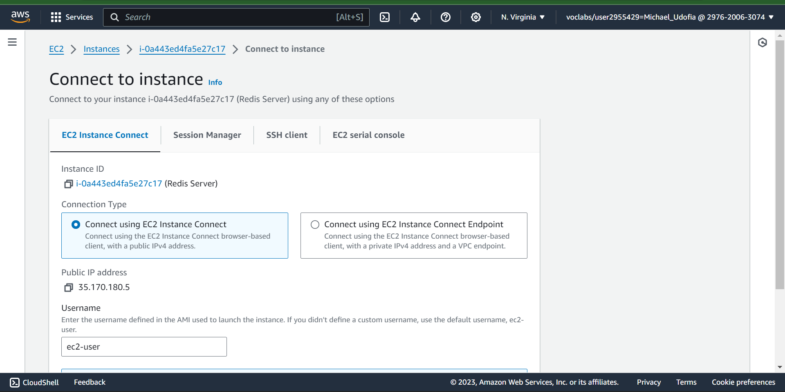
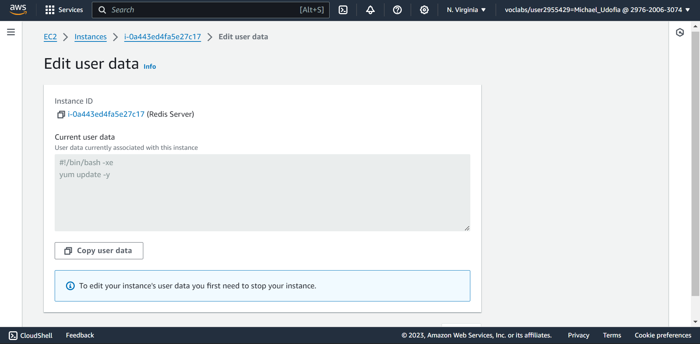

- ### **Task 1: Connect to the EC2 instance**
In this task, you connect to the Redis Server EC2 instance that was created for you when the lab started.

In the AWS Management Console in the Services menu, 
``````
enter EC2
``````
From the search results, choose 
``````
EC2
``````

From the EC2 Dashboard page, in the left navigation pane, choose 
``````
Instances
``````

Select the instance named 
``````
Redis Server
``````


Choose 
``````
Connect
``````

On the EC2 Instance Connect tab, choose 

    Connect
The connection to your instance opens in a new tab. Now, the following two tabs are open:

EC2 Instance Connect (where you are logged into your instance).

AWS Management Console (where you can navigate the console).
___

- ### **Task 2: Locate and view the user data script and log output**
A user data script ran when the Redis Server instance launched. This user data script updated the Operating System (OS).

In this task, you compare the user data script in the console with the user data script on the instance and confirm that they are the same. You also review the log output that the user data script generated when it ran.

First, review the user data configuration for the Redis Server instance in the AWS Management Console.

    Return to the AWS Management Console tab.

On the Connect to instance page, choose 

    Cancel

Select the instance named 

    Redis Server

Choose 

    Actions

Choose 

    Instance settings

Choose 

    Edit user data



Notice the text in the Current user data text box. It should match the following example:

    #!/bin/bash -xe
    yum update -y
    
Return to the EC2 Instance Connect tab.

Use the following command to view the contents of the user data script that resides on the EC2 instance:

    sudo cat /var/lib/cloud/instance/scripts/part-001